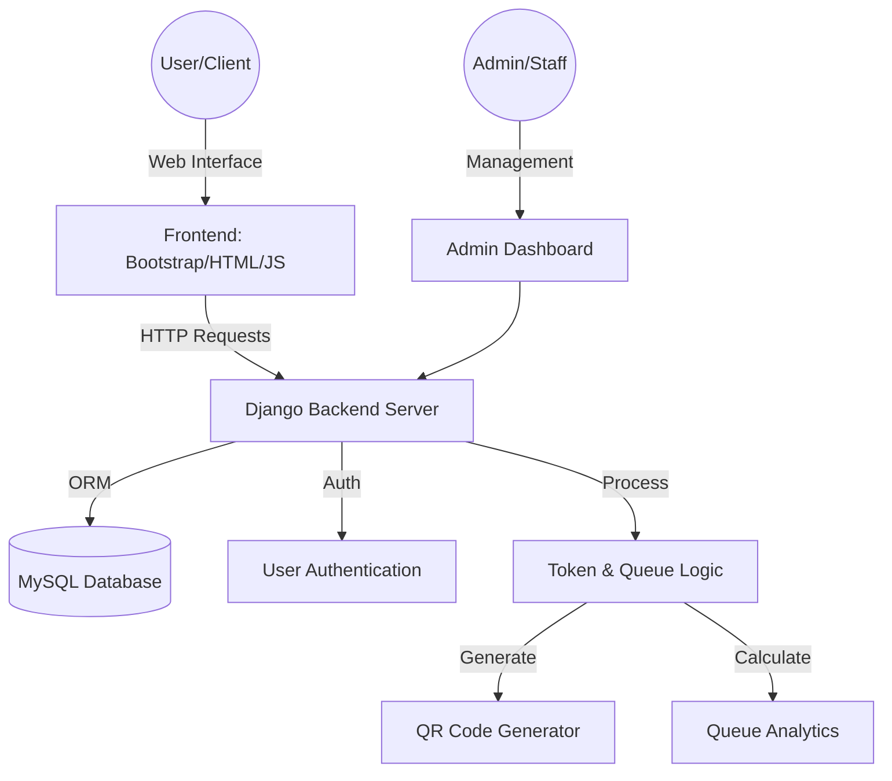
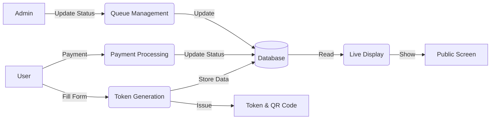
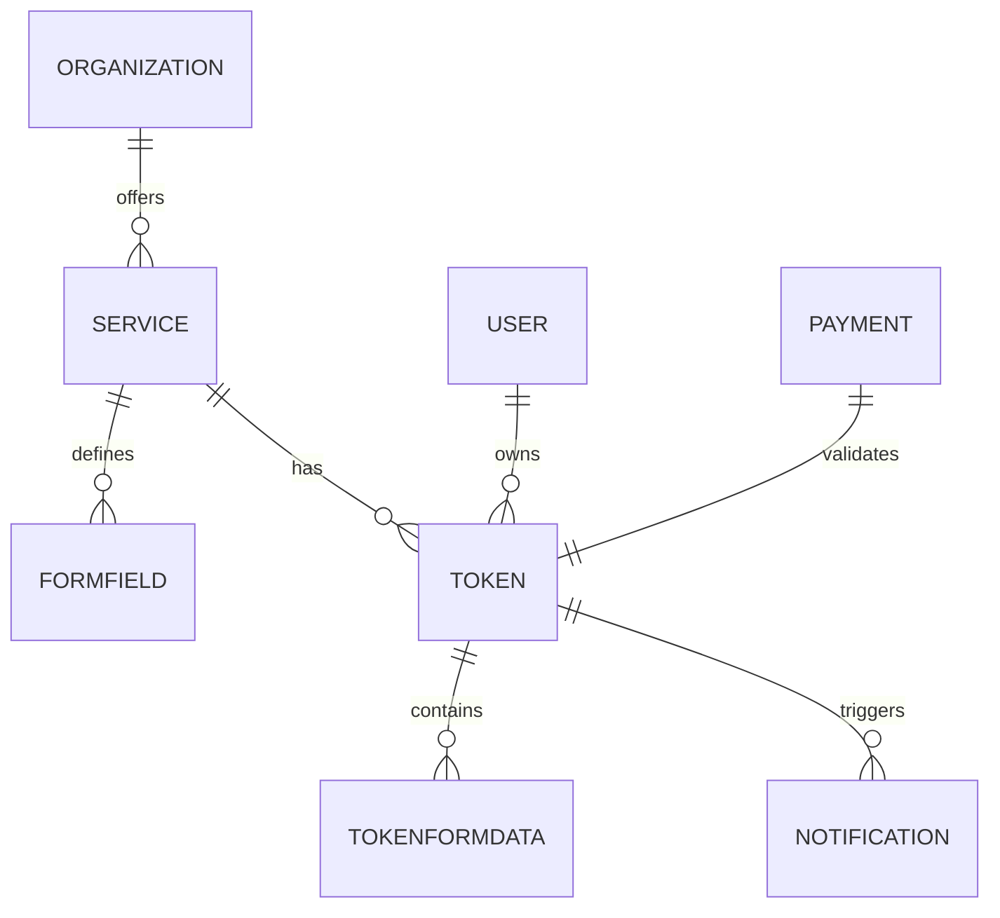

# Smart Queue Management System - Project Diagrams

Use these [Mermaid](https://mermaid.js.org/) diagrams for your project report. You can paste them into any Markdown viewer (like GitHub or VS Code) or use the Mermaid Live Editor.

## 1. System Architecture


## 2. Data Flow Diagram (DFD - Level 1)


## 3. Use Case Diagram
```mermaid
useCaseDiagram
    actor "User" as U
    actor "Admin/Staff" as A
    actor "System Admin" as SA

    package "Smart Queue System" {
        usecase "Register/Login" as UC1
        usecase "Join Queue (Get Token)" as UC2
        usecase "Make Payment" as UC3
        usecase "View Token Status" as UC4
        usecase "Cancel Token" as UC5
        usecase "View My Token History" as UC6
        
        usecase "Manage Queue (Call Next)" as UC7
        usecase "Update Token Status" as UC8
        usecase "View Analytics" as UC9
        
        usecase "Setup Organization/Services" as UC10
        usecase "Design Dynamic Forms" as UC11
    }

    U --> UC1
    U --> UC2
    U --> UC3
    U --> UC4
    U --> UC5
    U --> UC6

    A --> UC7
    A --> UC8
    A --> UC9

    SA --> UC10
    SA --> UC11
    SA --> UC1
```

## 4. Entity Relationship Diagram (ERD)

